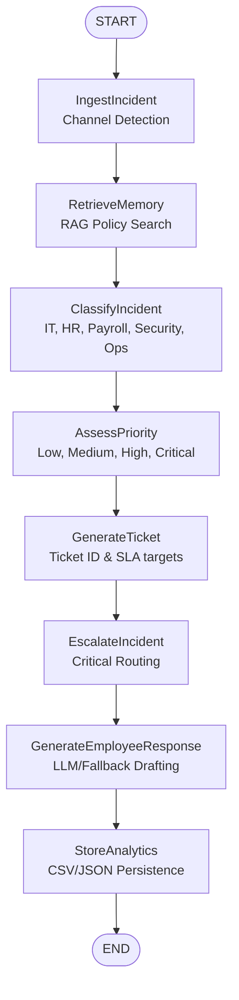

# AIMA – AI-Driven Incident Management Assistant

AIMA is a production-grade, AI-powered Incident Management Assistant built on top of LangGraph, FastAPI, and Streamlit. It automates the complete lifecycle of employee incidents—from ingestion and channel detection to category classification, priority assessment, RAG-based policy retrieval, ticket generation, SLA metrics calculation, escalation management, and customer-ready drafting.

---

## System Architecture & Orchestration

AIMA utilizes a **LangGraph StateGraph** to sequence processing states linearly. This design guarantees atomic execution step-by-step and updates the state dict at each node while building a persistent reasoning trace.



---

## 📚 Technical Documentation Hub

To explore specific parts of the codebase, refer to these detailed developer and operator guides:

*   📖 **[System Architecture & Orchestration Guide](file:///c:/Users/kavad/New%20folder%20(6)/docs/architecture_and_workflow.md)**: Explains the LangGraph execution flow nodes, the `AgentState` schema dictionary, and local classification fallbacks.
*   🧠 **[RAG Policy Memory Guide](file:///c:/Users/kavad/New%20folder%20(6)/docs/rag_memory_system.md)**: Outlines the ChromaDB persistent vector database setup, locally cached SentenceTransformers embeddings model (`all-MiniLM-L6-v2`), and the keyword-overlapping search algorithm used as backup.
*   🔌 **[FastAPI API Reference](file:///c:/Users/kavad/New%20folder%20(6)/docs/api_reference.md)**: Details HTTP REST endpoints, request/response payload structures, health probes, and static routing for the employee front-end.
*   ⚙️ **[Setup & Operations Guide](file:///c:/Users/kavad/New%20folder%20(6)/docs/setup_and_operations.md)**: Provides a breakdown of environment configuration files, multi-process startup execution scripts, local CSV database schemas, and background calculation utilities.

---

## Setup & Running Instructions

### Prerequisites
Make sure Python 3.10+ is installed on your system.

### 1. Install Dependencies
```powershell
pip install -r requirements.txt
```

### 2. Configure Environment Variables
Create a `.env` file in the project root containing your API key (if utilizing OpenRouter for advanced LLM execution):
```env
OPENAI_API_BASE=https://openrouter.ai/api/v1
OPENAI_API_KEY=your_openrouter_api_key
OPENAI_MODEL=openai/gpt-4o-mini
```
*Note: If no API key is specified (or contains the default `your_` template text), the system automatically redirects execution paths through a local Heuristic Fallback Engine.*

### 3. Start the Unified Platform
```powershell
python run.py
```
This runs the FastAPI backend and Streamlit dashboard concurrently:
- **Employee Portal**: `http://localhost:8000` (Redirects to the Glassmorphism HTML portal under `/static`)
- **Admin Dashboard**: `http://localhost:8501`

---

## Test Scenarios & Expectations

AIMA handles and auto-resolves all 7 of the target evaluation scenarios:

1. **VPN access denied** $\rightarrow$ Category: `IT`, Priority: `Medium`, SLA: 24h, Policy: VPN Access Policy.
2. **Salary not credited** $\rightarrow$ Category: `Payroll`, Priority: `High`, SLA: 8h, Policy: Salary and Direct Deposit Cycles.
3. **Leave request pending** $\rightarrow$ Category: `HR`, Priority: `Low`, SLA: 48h, Policy: Leave Accrual and Approval Workflow.
4. **Harassment complaint** $\rightarrow$ Category: `HR`, Priority: `Critical`, SLA: 4h, Escalated to: `hr-manager@talenttech.com`, Policy: Anti-Harassment.
5. **Server outage** $\rightarrow$ Category: `Operations`, Priority: `Critical`, SLA: 4h, Escalated to: `operations-manager@talenttech.com`, Policy: Network Outage Escalation Plan.
6. **Data breach detected** $\rightarrow$ Category: `Security`, Priority: `Critical`, SLA: 4h, Escalated to: `security-manager@talenttech.com`, Policy: Data Breach and Security Incident Response.
7. **MFA login failure** $\rightarrow$ Category: `IT`, Priority: `Medium`, SLA: 24h, Policy: MFA Login & Reset Policy.

