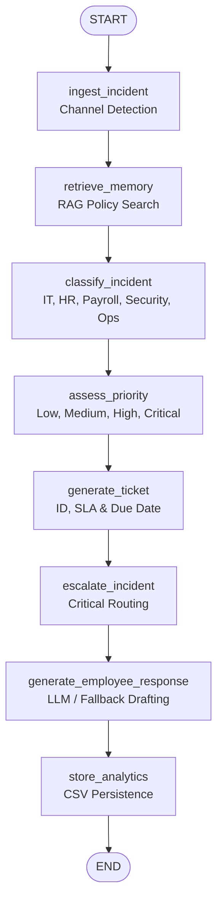

# AIMA System Architecture & Orchestration

This document details the system architecture of the **AI-Driven Incident Management Assistant (AIMA)**, focusing on state orchestration, data lifecycle, and the fallback processing engine.

---

## State Graph Orchestration

AIMA utilizes a **LangGraph StateGraph** to sequence processing states linearly. This design guarantees atomic execution step-by-step, where each node performs a discrete action, updates the incident's state, and appends messages or outcomes to a trace log.

### Graph Flow Diagram

---

## Pipeline Node Detailed Specifications

The LangGraph orchestration pipeline comprises 8 execution nodes defined in [workflow.py](file:///c:/Users/kavad/New%20folder%20(6)/workflow.py):

### 1. Ingest Incident (`ingest_incident`)
*   **Purpose**: Receives the initial employee report and detects the ingestion channel.
*   **Logic**: If no `source` is provided, analyzes the `issue` string:
    *   Starts with `+` or digits/colons $\rightarrow$ **WhatsApp**
    *   Contains `subject:`, `from:`, `sender:`, or `@` $\rightarrow$ **Gmail**
    *   Otherwise $\rightarrow$ **Employee Portal**
*   **Outputs**: `source` and initiates the `reasoning_trace` with `"✓ Incident received"`.

### 2. Retrieve Memory (`retrieve_memory`)
*   **Purpose**: Semantic policy search (RAG) using local memory resources.
*   **Logic**: Passes the incident text to the memory engine to retrieve the top 3 matching corporate policies.
*   **Outputs**: `memory` (list of policy strings) and appends `"✓ Memory retrieved"` to the trace.

### 3. Classify Incident (`classify_incident`)
*   **Purpose**: Categorizes the incident.
*   **Logic**: Uses the LLM prompt or the `FallbackEngine` rule-based heuristics to assign exactly one category: `IT`, `HR`, `Payroll`, `Security`, or `Operations`.
*   **Outputs**: `category` and appends `"✓ Category assigned"` to the trace.

### 4. Assess Priority (`assess_priority`)
*   **Purpose**: Evaluates the severity/priority.
*   **Logic**: Uses the LLM or `FallbackEngine` rules to determine a level: `Low`, `Medium`, `High`, or `Critical`.
*   **Outputs**: `priority` and appends `"✓ Priority calculated"` to the trace.

### 5. Generate Ticket (`generate_ticket`)
*   **Purpose**: Creates ticket metadata.
*   **Logic**:
    *   Generates a unique ID matching `CAT-YYYYMMDD-HEX4` (e.g. `IT-20260618-ABCD`).
    *   Looks up SLA targets based on category and priority:
        *   `Critical`: 4 hours
        *   `High`: 8 hours
        *   `Medium`: 24 hours
        *   `Low`: 48 hours
    *   Calculates the exact resolution `due_date` using the current timestamp plus the SLA hours.
*   **Outputs**: `ticket_id`, `sla_hours`, `due_date` and appends `"✓ Ticket generated"` to the trace.

### 6. Escalate Incident (`escalate_incident`)
*   **Purpose**: Checks critical routing rules.
*   **Logic**: Only executed if priority is `Critical`. Inspects keywords and category to assign a target manager email address:
    *   *Security Breaches / Leaks / Hacks* $\rightarrow$ `security-manager@talenttech.com`
    *   *HR Harassment / Conduct / Abuse / Discrimination* $\rightarrow$ `hr-manager@talenttech.com`
    *   *Operations / System Outages / Server Down* $\rightarrow$ `operations-manager@talenttech.com`
    *   *Other Criticals* $\rightarrow$ `support-director@talenttech.com`
*   **Outputs**: `escalated` (bool), `escalation_contact` (str), and appends `"✓ Escalation checked"` to the trace.

### 7. Generate Employee Response (`generate_employee_response`)
*   **Purpose**: Formulates the primary technician response.
*   **Logic**: Triggers the LLM prompt or the fallback engine to write a professional email draft that cites the Ticket ID, assigned support team, SLA window, and instructions from retrieved policies.
*   **Outputs**: `response` and appends `"✓ Response generated"` to the trace.

### 8. Store Analytics (`store_analytics`)
*   **Purpose**: Persists the workflow outcomes.
*   **Logic**: Calls `save_ticket()` from [ticketing.py](file:///c:/Users/kavad/New%20folder%20(6)/ticketing.py) to write the state copy into the CSV backend.
*   **Outputs**: Completes execution by routing to the graph `END`.

---

## State Management (`AgentState`)

The state dictionary is structured in [state.py](file:///c:/Users/kavad/New%20folder%20(6)/state.py) using Python's `TypedDict`. Below is the complete schema definition and operational descriptions:

| Field Name | Type | Description |
| :--- | :--- | :--- |
| `issue` | `str` | The original raw text description of the employee's incident. |
| `source` | `str` | Detected or provided channel (`Employee Portal`, `Gmail`, `WhatsApp`). |
| `memory` | `List[str]` | A list of retrieved policy snippets (up to 3) matching the incident description. |
| `category` | `str` | Resolved category (`IT`, `HR`, `Payroll`, `Security`, `Operations`). |
| `priority` | `str` | Evaluated severity priority (`Low`, `Medium`, `High`, `Critical`). |
| `ticket_id` | `str` | Unique ticket identity code formatted as `CAT-YYYYMMDD-HEX4`. |
| `escalated` | `bool` | True if the incident is critical and routed to a department manager. |
| `escalation_contact`| `str` | Recipient email address for critical escalation alerts. |
| `response` | `str` | Professional draft message addressing the employee's issue. |
| `reasoning_trace` | `List[str]`| Chronological execution checklist tracking completed pipeline stages. |
| `sla_hours` | `int` | Maximum allowed time window in hours for ticket resolution. |
| `due_date` | `str` | Target completion deadline formatted as `YYYY-MM-DD HH:MM:SS`. |

---

## Heuristics & LLM Fallback Engine

AIMA is engineered for high-availability. When an LLM API key (`OPENAI_API_KEY`) is unavailable or if remote service requests encounter network blocks, the system invokes a robust local rule-based heuristic suite (`FallbackEngine` in [models.py](file:///c:/Users/kavad/New%20folder%20(6)/models.py)).

### Fallback Classification Rules
- **Security**: Triggered by keywords: `breach`, `leak`, `unauthorized`, `hack`, `security`, `malware`, `virus`, `incident` (except simple login keywords, which fall back to IT unless serious breach markers are present).
- **HR**: Triggered by keywords: `harass`, `bully`, `abuse`, `threat`, `conduct`, `leave`, `vacation`, `holiday`, `absence`, `sick`.
- **Operations**: Triggered by keywords: `server down`, `outage`, `system down`, `network down`, `database offline`, `crashed`, `timeout`, `databases are completely down`.
- **Payroll**: Triggered by keywords: `salary`, `pay`, `credited`, `payslip`, `deposit`, `finance`.
- **IT**: Triggered by keywords: `vpn`, `login`, `password`, `mfa`, `authenticator`, `wifi`, `internet`, `laptop`, `pc`, `software`, `outlook`. Defaults to **IT** if no keywords match.

### Fallback Priority Assessment
- **Critical**: Assigned if category is `Security`, or if keywords like `harass`/`bully`/`abuse` match in `HR`, or if outages match in `Operations`.
- **High**: Assigned if category is `Payroll` and keywords indicate salary delays/failures (`delay`, `missing`, `not credited`).
- **Medium**: Assigned if category is `IT` and indicates connection blockers (`vpn`, `login`, `mfa`, `authenticator`, `password`).
- **Low**: The default severity for general inquiries and leave requests.

### Fallback Response Template
Constructs a professional email acknowledging the issue, providing the generated Ticket ID, target team name (e.g. `IT Support Team`, `HR Relations Team`), resolution SLA time, and direct excerpts from retrieved policies.
