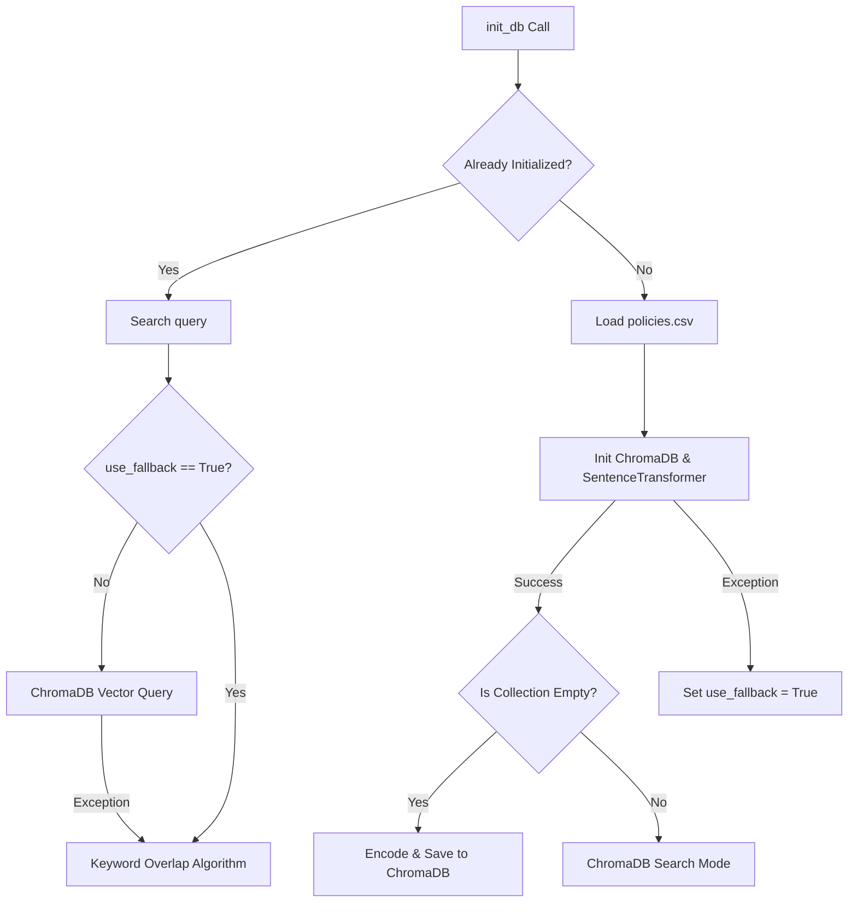

# RAG Policy Memory System

This document outlines the **Retrieval-Augmented Generation (RAG)** system built into AIMA. The subsystem resolves user queries against corporate guidelines using semantic embedding search, supported by an advanced local keyword matching fallback engine for high availability.

---

## Architecture Overview

The memory system is configured in [memory.py](file:///c:/Users/kavad/New%20folder%20(6)/memory.py) and consumes policy templates stored in [policies.csv](file:///c:/Users/kavad/New%20folder%20(6)/policies.csv).



---

## Subsystems & Components

### 1. Seeding Source ([policies.csv](file:///c:/Users/kavad/New%20folder%20(6)/policies.csv))
A CSV spreadsheet holding the corporate policy rules. It contains four columns:
*   `policy_id`: Primary index (e.g. `POL-101`).
*   `category`: Corporate department routing classification (`IT`, `HR`, `Payroll`, `Security`, `Operations`).
*   `title`: Descriptive subject line.
*   `content`: Full detailed policy text.

### 2. Embeddings Model (`SentenceTransformer`)
AIMA hosts the open-source **`all-MiniLM-L6-v2`** model locally via the `sentence-transformers` library.
*   It generates 384-dimensional dense floating-point vector representations.
*   To ensure environments remain isolated, the model cache directory is set locally inside the project workspace directory at `./.hf_cache` via the `HF_HOME` environment variable.

### 3. Vector Database (`ChromaDB`)
Utilizes a persistent Chroma storage layout located under the `chroma_db/` project directory.
*   Acts as the semantic document collection storage.
*   Documents are stored as: `"[<category>] <title>: <content>"`.
*   Metadata attributes including `category` and `title` are appended to support advanced semantic queries.

---

## Initialization & Seeding Flow

On the first query request, the pipeline calls `init_db()` to run the following sequence:
1.  **Read CSV**: Reads [policies.csv](file:///c:/Users/kavad/New%20folder%20(6)/policies.csv) into memory using Pandas, building a backup list of dictionary records.
2.  **Model Loading**: Loads the `all-MiniLM-L6-v2` model.
3.  **Client Bind**: Binds a persistent SQLite-backed Chroma database under `chroma_db/`.
4.  **Collection Seeding**: Checks the item count. If the database collection is empty, iterates over the CSV records, formats the text, computes model vectors, and adds them to Chroma DB.

If step 2 or 3 fails (e.g. due to proxy blocks, missing packages, or C++ compilation errors on Windows), the system automatically intercepts the error and activates the fallback engine by setting `self.use_fallback = True`.

---

## Keyword Overlapping Fallback Search Engine

To guarantee 100% service availability, AIMA includes a custom keyword matching algorithm that runs locally when vector stores are unreachable or during setup failures.

### Tokenization
The query and documents are parsed into clean lowercase token lists using regex matching:
```python
def re_tokenize(text: str) -> list[str]:
    import re
    return re.findall(r'\b\w+\b', text)
```
Tokens shorter than 3 characters (e.g., `"a"`, `"in"`, `"to"`) are discarded to ignore common stop words.

### Scoring Criteria
The search engine compares the set of query tokens against each policy text and computes a matching score:

| Match Condition | Score Weight | Description |
| :--- | :--- | :--- |
| **Category Token Match** | **+5** | Added for every matching query token found in the policy category field. |
| **Title Token Match** | **+3** | Added for every matching query token found in the policy title. |
| **Content Token Match** | **+1** | Added for every matching query token found in the policy content block. |
| **Exact Category Match** | **+10** | Applied once if standard categories (`it`, `hr`, `payroll`, `security`, `operations`) are found in both query and policy category. |

### Retrieval
All policies are evaluated, sorted in descending order based on score, and the top $N$ (default 3) policy documents are returned as context for the classification and response prompts.
