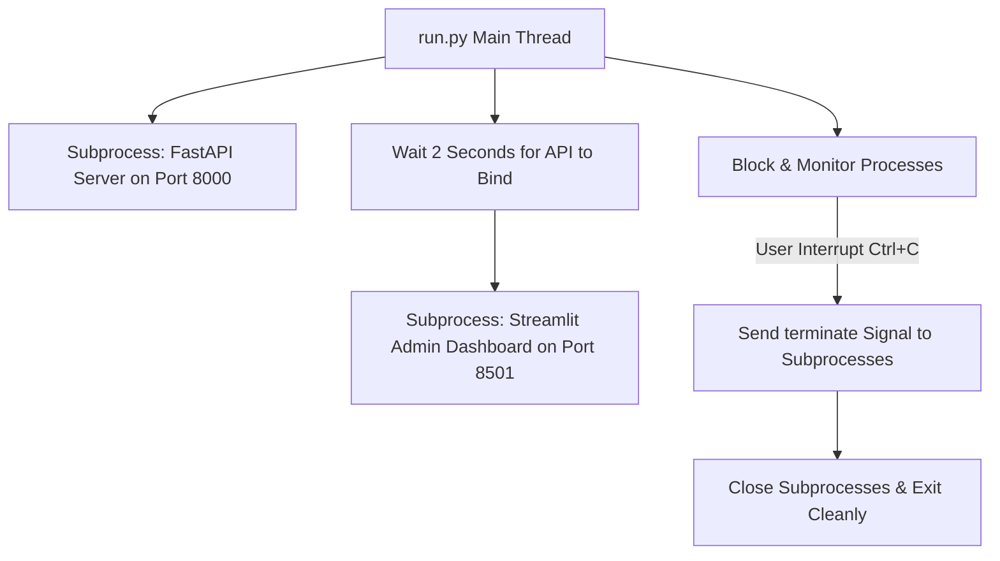

# AIMA Setup & Operations Guide

This guide covers deployment, environment configuration, system execution, and background analytical tools that manage the back-office operations of **AIMA**.

---

## Configuration & Environment

AIMA requires a `.env` file in the project root to load core execution variables.

### Environment Schema (`.env`)
```env
OPENAI_API_BASE=https://openrouter.ai/api/v1
OPENAI_API_KEY=your_openrouter_api_key
OPENAI_MODEL=openai/gpt-4o-mini
```

*   **API Inactivity Mode**: If `OPENAI_API_KEY` is empty, missing, or matches the default template value `"your_openrouter_api_key"`, the system automatically defaults to its local heuristic rule engine and keyword search module, requiring no active internet connections or api costs.

---

## Launcher & Processes Execution

The platform includes a orchestrating script, [run.py](file:///c:/Users/kavad/New%20folder%20(6)/run.py), which handles launching the separate web components in parallel.



### Starting the Platform
To launch the entire platform with one command, execute:
```powershell
python run.py
```

*   **Employee Customer Portal**: Available at `http://localhost:8000`
*   **Admin Analytics Portal**: Available at `http://localhost:8501`

---

## Incident Database Schema

AIMA uses a local flat-file CSV database, [incidents.csv](file:///c:/Users/kavad/New%20folder%20(6)/incidents.csv), managed inside [ticketing.py](file:///c:/Users/kavad/New%20folder%20(6)/ticketing.py).

### Seeding
If the `incidents.csv` file is not present on start, the server automatically boots `initialize_database()` to write the header row and seed the file with **8 historical incidents** representing various departments, priorities, and resolution statuses (`Open`, `In Progress`, `Resolved`). This ensures analytics, SLA charts, and reports are populated on first launch.

### Database Schema Table

The table below lists the columns defined in `COLUMNS` of [ticketing.py](file:///c:/Users/kavad/New%20folder%20(6)/ticketing.py):

| Column Name | Type | Sample Value | Description |
| :--- | :--- | :--- | :--- |
| `ticket_id` | `str` | `IT-20260617-A1B2` | Globally unique identifier structured as `CAT-YYYYMMDD-HEX4`. |
| `issue` | `str` | `"VPN access denied..."` | Original text description of the employee's request. |
| `source` | `str` | `"Gmail"` | Ingestion channel (`Gmail`, `WhatsApp`, `Employee Portal`). |
| `category` | `str` | `"IT"` | Categorization tag (`IT`, `HR`, `Payroll`, `Security`, `Operations`). |
| `priority` | `str` | `"Medium"` | Severity level (`Low`, `Medium`, `High`, `Critical`). |
| `escalated` | `bool` | `False` | Boolean indicating if the ticket was escalated to a manager. |
| `escalation_contact`| `str` | `""` | Destination manager email if escalated, else blank. |
| `response` | `str` | `"Your issue has..."` | The system's draft email response addressing the user. |
| `reasoning_trace` | `str` | `"✓ Incident received\n..."` | Newline-separated list of workflow checkpoints completed. |
| `timestamp` | `str` | `2026-06-17 09:15:00` | Ingestion timestamp formatted as `YYYY-MM-DD HH:MM:SS`. |
| `sla_hours` | `int` | `24` | SLA resolution window in hours. |
| `due_date` | `str` | `2026-06-18 09:15:00` | Target deadline computed by adding SLA hours to timestamp. |
| `status` | `str` | `"In Progress"` | Live status of the ticket (`Open`, `In Progress`, `Resolved`). |

---

## Analytics & Operational Tools

The [tools.py](file:///c:/Users/kavad/New%20folder%20(6)/tools.py) file houses calculation routines used to compute core system analytics:

### 1. SLA Duration Lookup (`calculate_sla`)
Resolves standard corporate SLAs based on ticket priority:
*   `Critical` $\rightarrow$ 4 hours
*   `High` $\rightarrow$ 8 hours
*   `Medium` $\rightarrow$ 24 hours
*   `Low` (and default) $\rightarrow$ 48 hours

### 2. SLA Compliance Tracker (`calculate_sla_performance`)
Computes SLA health trends for the admin dashboard:
*   Scans tickets logged over a rolling window (defaults to 7 days).
*   Calculates a compliance rate percentage.
*   **Breach Criteria**: Tickets are logged as breached if they are unresolved (`Open` or `In Progress`) and their `due_date` timestamp has passed the current system time, or if historical resolved tickets fail a simulated compliance check (defaults to 90% mock compliance).

### 3. Analytics Aggregator (`get_incident_statistics`)
Aggregates key metrics from `incidents.csv` for backend reporting:
*   Calculates counts of total, escalated, and critical incidents.
*   Groups count stats by status: `Open`, `In Progress`, and `Resolved`.
*   Calculates simulated average resolution times as $80\%$ of average SLA margins.
